# Architecture & Design Patterns

> **Audience:** Developers who want to understand _why_ the code is structured the way it is.
>
> This document catalogues every architectural and design pattern used in this repository, explains
> the concept behind each one, shows where it appears in the code, and points to direct alternatives
> so you can make informed trade-off decisions in your own projects.

---

## Table of Contents

1. [Layered Architecture](#1-layered-architecture)
2. [Dual DbContext / Shared-Schema Multi-Tenancy](#2-dual-dbcontext--shared-schema-multi-tenancy)
3. [Template Method — DbContext Inheritance](#3-template-method--dbcontext-inheritance)
4. [EF Core Global Query Filters](#4-ef-core-global-query-filters)
5. [Ambient Context — Tenant Resolution](#5-ambient-context--tenant-resolution)
6. [Service Layer with Interface-per-Service](#6-service-layer-with-interface-per-service)
7. [Constructor Dependency Injection](#7-constructor-dependency-injection)
8. [Options Pattern — Strongly-Typed Configuration](#8-options-pattern--strongly-typed-configuration)
9. [Static Factory Pattern](#9-static-factory-pattern)
10. [DTO Pattern with Projection Expressions](#10-dto-pattern-with-projection-expressions)
11. [Extension Methods — Mapping Helpers](#11-extension-methods--mapping-helpers)
12. [DTO Inheritance / Request Hierarchy](#12-dto-inheritance--request-hierarchy)
13. [Claim-Based & Policy-Based Authorization](#13-claim-based--policy-based-authorization)
14. [Middleware Exception Handling](#14-middleware-exception-handling)
15. [Design-Time DbContext Factory](#15-design-time-dbcontext-factory)
16. [Static Constants — Magic String Elimination](#16-static-constants--magic-string-elimination)
17. [CQRS-Lite — Read/Write Path Separation](#17-cqrs-lite--readwrite-path-separation)
18. [OpenAPI Document Transformer](#18-openapi-document-transformer)

---

## 1. Layered Architecture

### Concept

Layered (N-Tier) architecture organises code into horizontal slices where each layer has a single
responsibility and may only depend on the layer directly below it. The goal is to keep concerns
separated so that changes in one layer (e.g. swapping SQLite for Postgres) don't ripple upward.

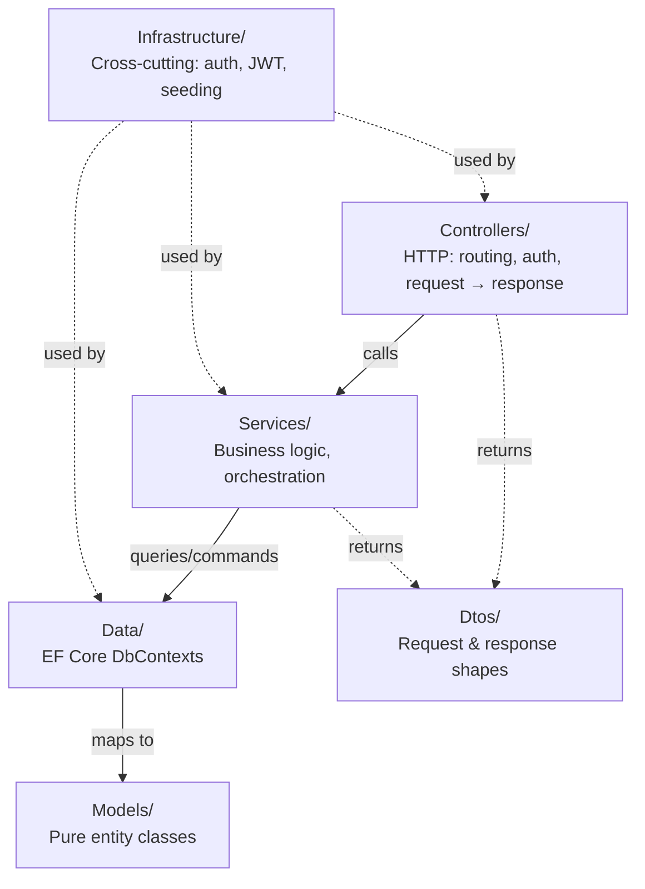

### In this repo

| Layer         | Folder            | Example                                            |
|---------------|-------------------|----------------------------------------------------|
| Presentation  | `Controllers/`    | `CustomersController` receives HTTP, calls service |
| Application   | `Services/`       | `CustomersService` owns business rules             |
| Data Access   | `Data/`           | `TenantDbContext`, `AdminDbContext`                |
| Domain        | `Models/`         | `Customer`, `Account`, `Transaction`               |
| DTOs          | `Dtos/`           | `CustomerRequest`, `CustomerResponse`              |
| Cross-cutting | `Infrastructure/` | `BankAccessor`, `JwtTokenService`, `SeedData`      |

`Program.cs` wires all layers together via DI — it is the composition root.

### Alternatives

| Alternative                     | Trade-off                                                                                                                              |
|---------------------------------|----------------------------------------------------------------------------------------------------------------------------------------|
| **Clean Architecture / Onion**  | Inverts dependencies — domain has no outward dependencies at all. More boilerplate (interfaces for everything), better for large teams |
| **Vertical Slice Architecture** | Organises by feature (e.g. `Features/Customers/`) instead of layer. Reduces cross-feature coupling; can scatter shared concepts        |
| **Minimal API (no layers)**     | Everything in `Program.cs`. Fine for tiny services; becomes unmaintainable quickly                                                     |

---

## 2. Dual DbContext / Shared-Schema Multi-Tenancy

### Concept

A single database serves multiple tenants. All tenant data lives in the same tables,
distinguished by a `BankId` discriminator column. Two `DbContext` classes map to the same
schema but with different behaviors: one automatically filters every query to the current
tenant, the other sees everything.

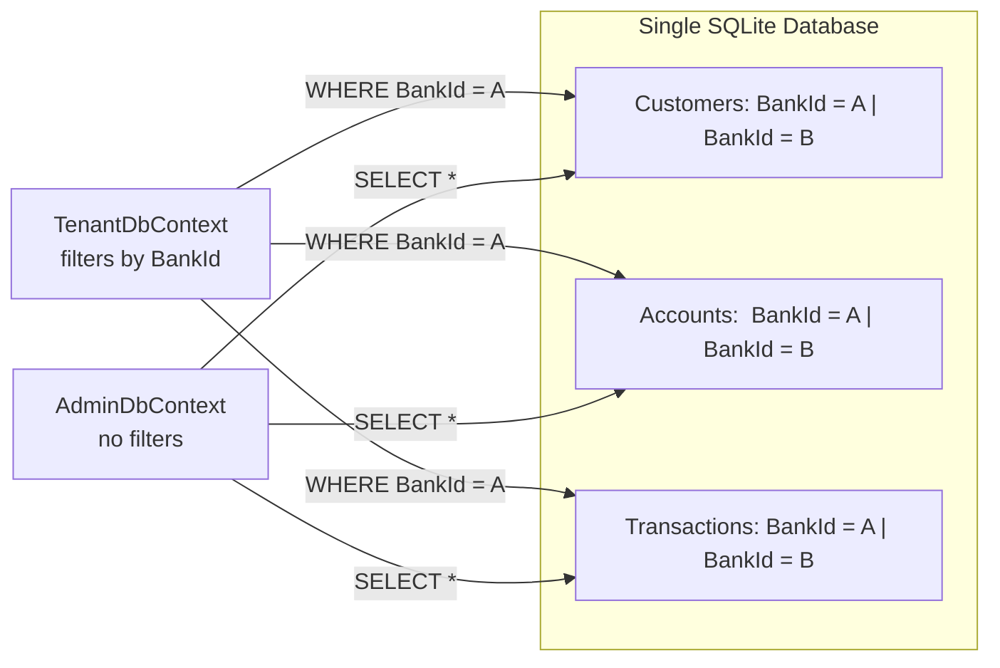

### In this repo

`TenantDbContext` registers EF Core global query filters in `OnModelCreating`. Every query on
`Customer`, `Account`, and `Transaction` automatically gets `WHERE BankId = @bankId` appended:

```csharp
// Data/TenantDbContext.cs
public sealed class TenantDbContext : AppDbContextBase
{
    public Guid BankId { get; }

    public TenantDbContext(DbContextOptions<TenantDbContext> options, IBankAccessor bankAccessor)
        : base(options)
    {
        BankId = bankAccessor.GetRequiredBankId();
    }

    protected override void OnModelCreating(ModelBuilder modelBuilder)
    {
        base.OnModelCreating(modelBuilder);

        modelBuilder.Entity<Customer>().HasQueryFilter(x => x.BankId == BankId);
        modelBuilder.Entity<Account>().HasQueryFilter(x => x.BankId == BankId);
        modelBuilder.Entity<Transaction>().HasQueryFilter(x => x.BankId == BankId);
    }
}
```

`AdminDbContext` inherits the same table/column configuration but adds no filters:

```csharp
// Data/AdminDbContext.cs
public sealed class AdminDbContext : AppDbContextBase
{
    public AdminDbContext(DbContextOptions<AdminDbContext> options)
        : base(options) { }

    // No OnModelCreating override = no query filters = sees all data
}
```

Both are registered against the same connection string in `Program.cs`:

```csharp
builder.Services.AddDbContext<TenantDbContext>(opt =>
    opt.UseSqlite(builder.Configuration.GetConnectionString("DefaultConnection")));
builder.Services.AddDbContext<AdminDbContext>(opt =>
    opt.UseSqlite(builder.Configuration.GetConnectionString("DefaultConnection")));
```

Tenant services inject `TenantDbContext`; admin services inject `AdminDbContext`. The choice of
context enforces the access boundary at the type level.

### Alternatives

| Alternative                                             | Trade-off                                                                                                                                                    |
|---------------------------------------------------------|--------------------------------------------------------------------------------------------------------------------------------------------------------------|
| **Database-per-tenant**                                 | Strongest isolation; trivial to restore a single tenant. Operationally expensive: N connection pools, N migration runs, difficult cross-tenant reporting     |
| **Schema-per-tenant**                                   | Moderate isolation; one database, separate schemas. Not well-supported by EF Core out of the box; migration tooling is complex                               |
| **Row-level security (PostgreSQL RLS)**                 | Enforcement at the database engine level — filters survive even raw SQL queries. Requires PostgreSQL; more complex setup; EF Core has no first-class support |
| **Manual `.Where(x => x.BankId == id)` in every query** | No framework magic, completely transparent. One forgotten `Where` leaks data — a silent, critical bug                                                        |
| **Single context + `IgnoreQueryFilters()` for admin**   | One context to maintain. Admin code must always remember to opt in rather than opt out — higher risk of accidental data leakage                              |

---

## 3. Template Method — DbContext Inheritance

### Concept

The Template Method pattern (GoF) defines an algorithm's skeleton in a base class and lets
subclasses override specific steps without changing the overall structure. The base class calls
the overridable steps at the right time; subclasses fill in the details.

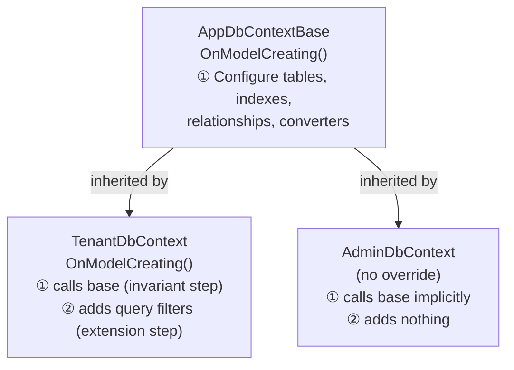

### In this repo

`AppDbContextBase.OnModelCreating` is the invariant step — it configures all entity shapes, indexes,
default values, cascade rules, and enum-to-string conversions. Both subclasses call `base.OnModelCreating`
first and then extend (or not):

```csharp
// Data/AppDbContextBase.cs — the shared template
protected override void OnModelCreating(ModelBuilder modelBuilder)
{
    base.OnModelCreating(modelBuilder);

    modelBuilder.Entity<Bank>(b =>
    {
        b.HasIndex(x => x.Code).IsUnique();
        b.Property(x => x.CreatedAt).HasDefaultValueSql("CURRENT_TIMESTAMP");
    });

    modelBuilder.Entity<User>(b =>
    {
        b.HasIndex(x => x.Email).IsUnique();
        b.Property(x => x.Role).HasConversion<string>().HasMaxLength(20);
    });

    modelBuilder.Entity<Account>(b =>
    {
        b.HasIndex(x => new { x.BankId, x.AccountNumber }).IsUnique();
        b.HasIndex(x => new { x.BankId, x.CustomerId });
        // ...
    });
    // ... Transaction, Customer
}
```

`TenantDbContext` calls `base.OnModelCreating` to get all of the above, then appends its filters.
`AdminDbContext` doesn't override `OnModelCreating` at all — it inherits everything from the base.

### Alternatives

| Alternative                               | Trade-off                                                                                                                                                       |
|-------------------------------------------|-----------------------------------------------------------------------------------------------------------------------------------------------------------------|
| **`IEntityTypeConfiguration<T>` classes** | Each entity's config lives in its own file. More discoverable at scale; no inheritance required. Doesn't express the "add filters on top" pattern as cleanly    |
| **Composition over inheritance**          | Pass a `bool applyTenantFilters` parameter to a shared helper method. Explicit rather than implicit; works but loses the natural EF Core `OnModelCreating` hook |

---

## 4. EF Core Global Query Filters

### Concept

A global query filter is a predicate (a condition expression) that EF Core **automatically appends**
to every LINQ query for a given entity type. You define it once in `OnModelCreating`; after that,
every query is silently filtered — including queries that come through navigation properties and
`.Include()`.

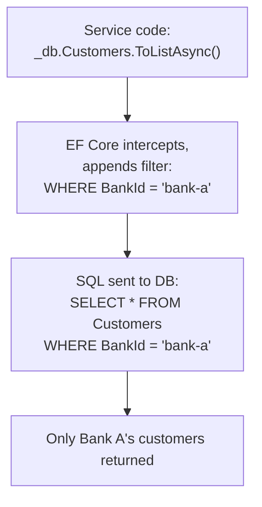

### In this repo

```csharp
// Data/TenantDbContext.cs
modelBuilder.Entity<Customer>().HasQueryFilter(x => x.BankId == BankId);
modelBuilder.Entity<Account>().HasQueryFilter(x => x.BankId == BankId);
modelBuilder.Entity<Transaction>().HasQueryFilter(x => x.BankId == BankId);
```

`BankId` here is a property on the `TenantDbContext` instance. EF Core captures it as a closure in
the expression tree, re-evaluating it per query so that each request gets the right tenant's data.

The filter applies even through navigation properties:

```csharp
// This join also respects the filter — accounts returned are Bank A's only
var customer = await _db.Customers
    .Include(x => x.Accounts)
    .SingleOrDefaultAsync(x => x.Id == id);
```

Services can bypass filters with `.IgnoreQueryFilters()`, but `TenantDbContext` is only injected
into tenant services — so the bypass is unavailable there without a deliberate code change.

### Alternatives

| Alternative                                                           | Trade-off                                                                                                |
|-----------------------------------------------------------------------|----------------------------------------------------------------------------------------------------------|
| **Manual `.Where()` on every query**                                  | Zero magic; completely auditable. One missed `Where` silently leaks data across tenants                  |
| **PostgreSQL Row-Level Security**                                     | Enforced at the engine level; survives raw SQL and any ORM. PostgreSQL-only; requires DB role management |
| **Interceptors (`ISaveChangesInterceptor`, `IDbCommandInterceptor`)** | More powerful (intercept at SQL level). More complex; harder to read                                     |
| **Owned entity / separate table per tenant**                          | True physical isolation per tenant. Eliminates discriminator columns; operationally very expensive       |

---

## 5. Ambient Context — Tenant Resolution

### Concept

The Ambient Context pattern makes a piece of contextual information (here: the current tenant's
`BankId`) available to any code in the call stack without passing it explicitly through every method
signature. A well-known accessor reads the value from the execution environment — in this case, the
ASP.NET Core `HttpContext`.

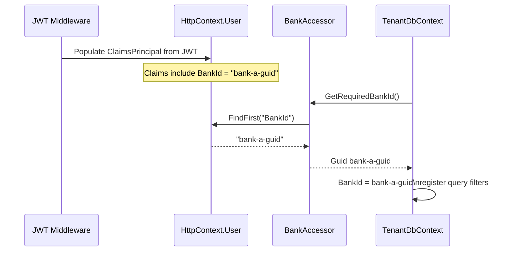

### In this repo

`IBankAccessor` defines a two-method contract. `BankAccessor` wraps `IHttpContextAccessor` to
extract the `BankId` claim from the currently authenticated user:

```csharp
// Infrastructure/BankAccessor.cs
public interface IBankAccessor
{
    Guid? TryGetBankId();        // null if no BankId claim (e.g. Admin user)
    Guid GetRequiredBankId();    // throws UnauthorizedAccessException if missing
}

public sealed class BankAccessor : IBankAccessor
{
    private readonly IHttpContextAccessor _httpContextAccessor;

    public BankAccessor(IHttpContextAccessor httpContextAccessor)
    {
        _httpContextAccessor = httpContextAccessor;
    }

    public Guid? TryGetBankId()
    {
        var user = _httpContextAccessor.HttpContext?.User;
        return user?.TryGetBankIdClaim();
    }

    public Guid GetRequiredBankId()
    {
        var bankId = TryGetBankId();
        if (bankId is null)
            throw new UnauthorizedAccessException("Missing BankId claim in token.");
        return bankId.Value;
    }
}
```

`TenantDbContext` receives `IBankAccessor` through constructor injection and calls
`GetRequiredBankId()` immediately — so the `BankId` is fixed at context-creation time
(once per request, since DbContext is scoped).

Using an interface rather than a concrete class means unit tests can inject a fake `IBankAccessor`
that returns any `BankId` without needing a real HTTP request.

### Alternatives

| Alternative                                                       | Trade-off                                                                                                                                                                             |
|-------------------------------------------------------------------|---------------------------------------------------------------------------------------------------------------------------------------------------------------------------------------|
| **Pass `Guid bankId` as a parameter to every service method**     | Fully explicit — easy to trace, easy to test. Verbose; the tenant ID leaks into every service signature                                                                               |
| **Custom middleware that sets a scoped `ITenantContext` service** | Centralises resolution in one place; services depend on `ITenantContext` instead of `IBankAccessor`. Nearly identical to this approach — just a different name and registration point |
| **Read from a custom HTTP header (`X-Bank-Id`)**                  | Simpler to construct in tests. Not tamper-proof — a client could send any `BankId`. Never use for security-relevant tenant isolation                                                  |
| **`AsyncLocal<T>` / `ThreadLocal<T>`**                            | Truly ambient — no DI needed. Fragile with async/await; easy to forget to set; hard to test                                                                                           |

---

## 6. Service Layer with Interface-per-Service

### Concept

The Service Layer pattern places all business logic in dedicated service classes that sit between the
controllers and the data access layer. Controllers become thin: they parse the request, call one
service method, and map the result to an HTTP response. Services own validation, entity
construction, and business rules.

Pairing each service with an interface (`ICustomersService` / `CustomersService`) decouples the
caller from the implementation.

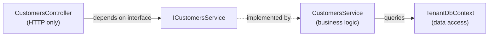

### In this repo

Every service is defined as an interface + sealed implementation in the same file. The interface is
what gets registered in DI and injected into controllers:

```csharp
// Services/CustomersService.cs
public interface ICustomersService
{
    Task<IReadOnlyList<CustomerResponse>> GetAll();
    Task<CustomerResponse?> GetById(Guid id);
    Task<CustomerResponse> Create(CustomerRequest request);
    Task<bool> Update(Guid id, UpdateCustomerRequest request);
    Task<bool> Delete(Guid id);
}

public sealed class CustomersService : ICustomersService
{
    private readonly TenantDbContext _db;

    public CustomersService(TenantDbContext db) => _db = db;

    public async Task<CustomerResponse> Create(CustomerRequest request)
    {
        var entity = new Customer
        {
            Id = Guid.NewGuid(),
            BankId = _db.BankId,       // tenant key from the context
            CreatedAt = DateTimeOffset.UtcNow,
        };
        entity.ApplyFields(request);   // apply validated request fields

        _db.Customers.Add(entity);
        await _db.SaveChangesAsync();

        return entity.ToResponse();    // map to DTO
    }
    // ...
}
```

The controller calls the service without knowing anything about EF Core or the database:

```csharp
// Controllers/CustomersController.cs
[HttpPost]
public async Task<ActionResult<CustomerResponse>> Create(CustomerRequest request)
{
    var created = await _customers.Create(request);
    return CreatedAtAction(nameof(GetById), new { id = created.Id }, created);
}
```

### Alternatives

| Alternative                                          | Trade-off                                                                                                                                                           |
|------------------------------------------------------|---------------------------------------------------------------------------------------------------------------------------------------------------------------------|
| **No service layer — business logic in controllers** | Zero overhead for simple CRUD. Untestable; logic duplicates across controllers as complexity grows                                                                  |
| **CQRS with MediatR**                                | Each operation is a distinct command/query object handled by its own handler. Excellent separation; discoverable. More classes and ceremony for simple operations   |
| **Domain-Driven Design (rich domain models)**        | Business logic lives on the entities themselves (`customer.Deposit(amount)`). Entities are self-validating; no anemic model. Requires more upfront domain modelling |

---

## 7. Constructor Dependency Injection

### Concept

Dependency Injection (DI) is a technique where objects declare what they need (their dependencies)
via constructor parameters, and an external container creates and wires those objects together.
No `new` keyword is scattered through business code; the composition root (`Program.cs`) owns
all object creation.

ASP.NET Core's built-in DI container supports three lifetimes:

| Lifetime      | Created               | Destroyed      | Use for                        |
|---------------|-----------------------|----------------|--------------------------------|
| **Transient** | Every time requested  | After use      | Lightweight, stateless helpers |
| **Scoped**    | Once per HTTP request | End of request | `DbContext`, per-request state |
| **Singleton** | Once, app startup     | App shutdown   | Configuration, caches          |

> **Critical:** `DbContext` must be `Scoped`. If it were `Singleton`, all requests would share the
> same `BankId` — a severe security bug.

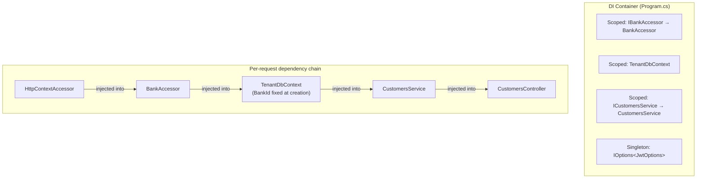

### In this repo

All service, infrastructure, and DbContext registrations are in `Program.cs`:

```csharp
builder.Services.AddHttpContextAccessor();
builder.Services.AddScoped<IBankAccessor, BankAccessor>();
builder.Services.AddScoped<IJwtTokenService, JwtTokenService>();

builder.Services.AddDbContext<TenantDbContext>(opt =>
    opt.UseSqlite(builder.Configuration.GetConnectionString("DefaultConnection")));
builder.Services.AddDbContext<AdminDbContext>(opt =>
    opt.UseSqlite(builder.Configuration.GetConnectionString("DefaultConnection")));

builder.Services.AddScoped<ICustomersService, CustomersService>();
builder.Services.AddScoped<IAccountsService, AccountsService>();
// ...
```

### Alternatives

| Alternative                                 | Trade-off                                                                                                                                             |
|---------------------------------------------|-------------------------------------------------------------------------------------------------------------------------------------------------------|
| **Service locator pattern**                 | Resolve dependencies on demand via `IServiceProvider.GetService<T>()`. Hides dependencies; makes testing harder; generally considered an anti-pattern |
| **Third-party containers (Autofac, Lamar)** | More features (decorators, convention-based registration, AOP). Extra dependency; rarely needed for apps this size                                    |
| **Static/global singletons**                | Zero boilerplate. Untestable; thread-safety issues; hidden coupling                                                                                   |

---

## 8. Options Pattern — Strongly-Typed Configuration

### Concept

Instead of reading raw string values from `IConfiguration` scattered across the codebase, the
Options pattern binds a configuration section to a typed POCO class. That POCO is injected via
`IOptions<T>`. Changes to the config structure are caught at startup (or compile time with
`ValidateOnStart`).

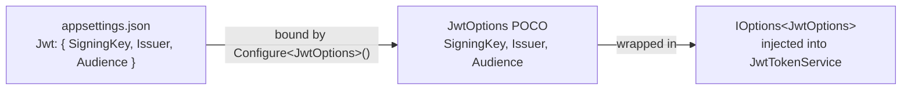

### In this repo

```csharp
// Infrastructure/JwtOptions.cs
public sealed class JwtOptions
{
    public const string SectionName = "Jwt";

    public string Issuer    { get; init; } = "BankingApi";
    public string Audience  { get; init; } = "BankingApi";
    public string SigningKey { get; init; } = string.Empty;
}
```

```csharp
// Program.cs
builder.Services.Configure<JwtOptions>(
    builder.Configuration.GetSection(JwtOptions.SectionName));
```

```csharp
// Infrastructure/JwtTokenService.cs
public sealed class JwtTokenService : IJwtTokenService
{
    private readonly JwtOptions _options;

    public JwtTokenService(IOptions<JwtOptions> options)
    {
        _options = options.Value;
    }
}
```

`Program.cs` also reads the options directly at startup to validate that `SigningKey` is set before
the app accepts any traffic:

```csharp
var jwtOptions = builder.Configuration.GetSection(JwtOptions.SectionName).Get<JwtOptions>()
    ?? new JwtOptions();
if (string.IsNullOrWhiteSpace(jwtOptions.SigningKey))
    throw new InvalidOperationException("JWT signing key is not configured.");
```

### Alternatives

| Alternative                                             | Trade-off                                                                                                        |
|---------------------------------------------------------|------------------------------------------------------------------------------------------------------------------|
| **`IConfiguration.GetValue<string>("Jwt:SigningKey")`** | Simpler for one value. String keys are not refactor-safe; config shape is invisible to callers                   |
| **`IOptionsSnapshot<T>`**                               | Re-reads config per request — supports hot reload. Only useful if config changes at runtime                      |
| **`IOptionsMonitor<T>`**                                | Notification callbacks on config change. For long-running background services; overkill for web request handling |
| **Environment variables directly**                      | Zero config layer. Not validated at startup; easy to misconfigure silently                                       |

---

## 9. Static Factory Pattern

### Concept

A factory centralises the construction of complex objects. Instead of scattering `new Entity { ... }`
throughout the codebase — and risking inconsistency — a single factory method is the one place that
knows how to build an entity correctly.

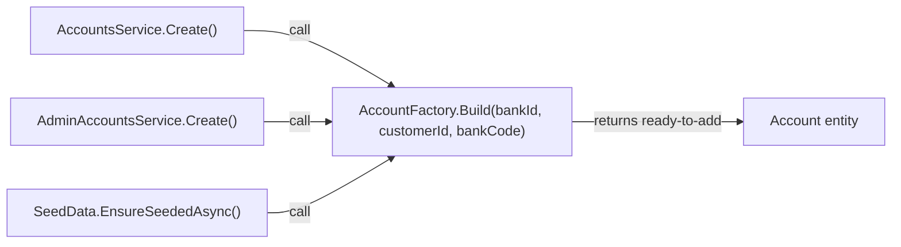

### In this repo

`AccountFactory` and `TransactionFactory` are `internal static` classes in `Services/`. The factory
owns the construction rules; callers own adding the entity to the `DbSet` and saving:

```csharp
// Services/AccountFactory.cs
internal static class AccountFactory
{
    internal static Account Build(Guid bankId, Guid customerId, string bankCode) =>
        new()
        {
            Id = Guid.NewGuid(),
            BankId = bankId,
            CustomerId = customerId,
            AccountNumber = $"{bankCode}-{Guid.NewGuid():N}".ToUpperInvariant(),
            Balance = 0m,
            Currency = Currency.Default,
            CreatedAt = DateTimeOffset.UtcNow,
        };
}
```

`TransactionFactory.Build` goes further — it also enforces a business rule (insufficient funds)
and mutates the account balance, making it a richer factory:

```csharp
// Services/TransactionFactory.cs
internal static Transaction Build(Guid bankId, Account account, TransactionRequest request)
{
    var type = request.Type.Equals("Debit", StringComparison.OrdinalIgnoreCase)
        ? TransactionType.Debit : TransactionType.Credit;

    if (type == TransactionType.Debit && account.Balance < request.Amount)
        throw new InvalidOperationException("Insufficient funds");

    account.Balance += type == TransactionType.Credit ? request.Amount : -request.Amount;

    return new Transaction { Id = Guid.NewGuid(), BankId = bankId, AccountId = account.Id, ... };
}
```

### Alternatives

| Alternative                             | Trade-off                                                                                                                                                              |
|-----------------------------------------|------------------------------------------------------------------------------------------------------------------------------------------------------------------------|
| **Factory method on the entity itself** | `Account.Create(bankId, customerId, bankCode)`. Keeps construction logic on the domain object. Requires entities to have static methods — mixes construction and state |
| **Builder pattern**                     | `new AccountBuilder().ForBank(bankId).ForCustomer(customerId).Build()`. Excellent for entities with many optional fields. Overkill here                                |
| **Domain service**                      | A DI-injected class that creates entities, allowing it to have its own dependencies (e.g. a unique-ID generator). Necessary if construction needs an async call        |

---

## 10. DTO Pattern with Projection Expressions

### Concept

Data Transfer Objects (DTOs) are simple classes used to carry data across layer boundaries. They
decouple the API contract from the database schema — you can evolve each independently.

The **Projection** variant goes further: instead of loading full entities into memory and then
mapping them in C#, the projection expression is passed directly to EF Core's `.Select()`. EF Core
translates the expression to a SQL `SELECT` that fetches _only the columns you need_, saving
bandwidth and memory.

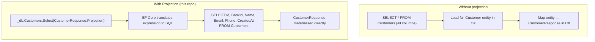

### In this repo

Each response DTO defines a static `Expression<Func<TEntity, TDto>> Projection` property:

```csharp
// Dtos/CustomerDtos.cs
public sealed class CustomerResponse
{
    public Guid Id { get; init; }
    public Guid BankId { get; init; }
    public string Name { get; init; } = string.Empty;
    public string? Email { get; init; }
    public string? Phone { get; init; }
    public DateTimeOffset CreatedAt { get; init; }

    public static Expression<Func<Customer, CustomerResponse>> Projection =>
        x => new CustomerResponse
        {
            Id = x.Id,
            BankId = x.BankId,
            Name = x.Name,
            Email = x.Email,
            Phone = x.Phone,
            CreatedAt = x.CreatedAt,
        };
}
```

Services use it in read queries:

```csharp
// Services/CustomersService.cs — read path (no entity loaded into memory)
public async Task<IReadOnlyList<CustomerResponse>> GetAll()
{
    return await _db.Customers
        .AsNoTracking()
        .OrderBy(x => x.Name)
        .Select(CustomerResponse.Projection)   // ← expression tree passed to EF Core
        .ToListAsync();
}
```

The same pattern is on `BankResponse`, `AccountResponse`, and `TransactionResponse`.

### Alternatives

| Alternative                                | Trade-off                                                                                                                                         |
|--------------------------------------------|---------------------------------------------------------------------------------------------------------------------------------------------------|
| **AutoMapper**                             | Less boilerplate for large models with many properties; config is centralised. Magic mapping is hard to debug; easy to accidentally expose fields |
| **Mapster**                                | Like AutoMapper but faster and with better source-gen support                                                                                     |
| **Manual mapping in service methods**      | Total control; zero magic. Verbose; mapping logic scattered                                                                                       |
| **Return entities directly from services** | Minimal code. Couples the API contract to the DB schema; impossible to add computed fields without polluting the entity                           |

---

## 11. Extension Methods — Mapping Helpers

### Concept

Extension methods add behaviour to existing types without modifying them. Here they serve two
mapping roles:

- `.ToResponse()` — converts a tracked entity to a DTO after a write operation (insert/update)
- `.ApplyFields()` — copies validated request fields onto a tracked entity before saving

This keeps mapping logic close to the DTO definitions (in `Dtos/`) rather than spreading it across
service files.

### In this repo

```csharp
// Dtos/CustomerDtos.cs
public static class CustomerExtensions
{
    // Used after Create/Update to build the response from a tracked entity
    public static CustomerResponse ToResponse(this Customer x) =>
        new()
        {
            Id = x.Id, BankId = x.BankId, Name = x.Name,
            Email = x.Email, Phone = x.Phone, CreatedAt = x.CreatedAt,
        };

    // Used in Create/Update to copy request fields onto a tracked entity
    public static void ApplyFields(this Customer entity, CustomerRequest request)
    {
        entity.Name  = request.Name.Trim();
        entity.Email = string.IsNullOrWhiteSpace(request.Email)
            ? null : request.Email.Trim().ToLowerInvariant();
        entity.Phone = string.IsNullOrWhiteSpace(request.Phone)
            ? null : request.Phone.Trim();
    }
}
```

Usage in a service:

```csharp
// Create
var entity = new Customer { Id = Guid.NewGuid(), BankId = _db.BankId, ... };
entity.ApplyFields(request);       // copy + normalise fields
_db.Customers.Add(entity);
await _db.SaveChangesAsync();
return entity.ToResponse();        // map tracked entity to DTO

// Update
entity.ApplyFields(request);       // same normalisation — no duplication
await _db.SaveChangesAsync();
```

`ClaimsExtensions` uses the same technique to add claim-reading helpers to `ClaimsPrincipal`:

```csharp
// Infrastructure/ClaimsExtensions.cs
public static class ClaimsExtensions
{
    public static Guid? TryGetBankIdClaim(this ClaimsPrincipal user)
    {
        var raw = user.FindFirst(AppClaimTypes.BankId)?.Value;
        return Guid.TryParse(raw, out var id) ? id : null;
    }

    public static Guid? TryGetCustomerIdClaim(this ClaimsPrincipal user) { ... }
    public static string GetRequiredRole(this ClaimsPrincipal user) { ... }
    public static Guid GetRequiredUserId(this ClaimsPrincipal user) { ... }
}
```

### Alternatives

| Alternative                       | Trade-off                                                                                                                      |
|-----------------------------------|--------------------------------------------------------------------------------------------------------------------------------|
| **Mapping methods on the entity** | `customer.ToResponse()` called on the entity directly. Introduces a dependency on DTOs in the domain model — a layer violation |
| **Mapping methods on the DTO**    | `CustomerResponse.From(entity)` static factory method. Similar to extension methods; slightly less fluent to call              |
| **Dedicated mapper class**        | `CustomerMapper.ToResponse(entity)`. More testable in isolation; more files                                                    |

---

## 12. DTO Inheritance / Request Hierarchy

### Concept

When tenant-scoped and admin operations share the same fields but differ only in _who_ supplies the
`BankId`, a base request class captures the shared fields and a derived admin class adds `BankId`.
This encodes the security boundary in the type system: forgetting to add `BankId` to an admin
request is a compile error, not a runtime surprise.

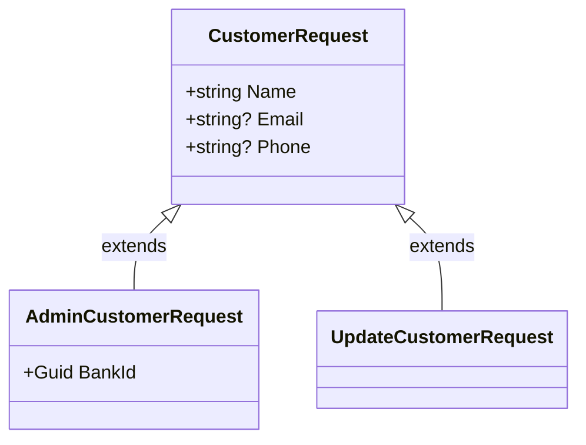

### In this repo

```csharp
// Dtos/CustomerDtos.cs

// Tenant-scoped request — BankId comes from the JWT, not the body
public class CustomerRequest
{
    [Required][MaxLength(200)] public string Name  { get; set; } = string.Empty;
    [EmailAddress][MaxLength(320)] public string? Email { get; set; }
    [MaxLength(40)] public string? Phone { get; set; }
}

// Admin request — caller must supply BankId explicitly
public sealed class AdminCustomerRequest : CustomerRequest
{
    [Required] public Guid BankId { get; set; }
}

// Update — same fields as create, no extra properties
public sealed class UpdateCustomerRequest : CustomerRequest { }
```

The same hierarchy exists for `Account` (`AccountRequest` → `AdminAccountRequest`) and
`Transaction` (`TransactionRequest` → `AdminTransactionRequest`). `BankDto` → `CreateBankRequest` /
`UpdateBankRequest` is another instance.

`ApplyFields` is defined on the base type, so both tenant services and admin services can call the
same normalisation logic:

```csharp
entity.ApplyFields(request);   // works for CustomerRequest and any subclass
```

### Alternatives

| Alternative                                                    | Trade-off                                                                                                                                                                 |
|----------------------------------------------------------------|---------------------------------------------------------------------------------------------------------------------------------------------------------------------------|
| **Single request DTO with an optional `BankId`**               | Fewer classes. `BankId` being `Guid?` is ambiguous — is it omitted intentionally or accidentally? Hard to enforce `[Required]` only for admin paths                       |
| **Completely separate request types**                          | Zero coupling between tenant and admin shapes. Duplication of shared validation attributes                                                                                |
| **Controller reads `BankId` from route/header and injects it** | Request body stays clean; the controller adds the tenant ID before calling the service. Works but shifts the responsibility to the controller rather than the type system |

---

## 13. Claim-Based & Policy-Based Authorization

### Concept

JWT claims are key-value pairs embedded in a signed token. ASP.NET Core authorization policies are
named rule sets that check for specific claims. Applying `[Authorize(Policy = "Staff")]` to a
controller means: "the caller's JWT must contain `role=Staff`."

Using named policies (rather than `[Authorize(Roles = "Staff")]` directly) decouples the
authorization logic from its enforcement points — if you need to change what "Staff" means, you
change one policy registration, not every `[Authorize]` attribute.

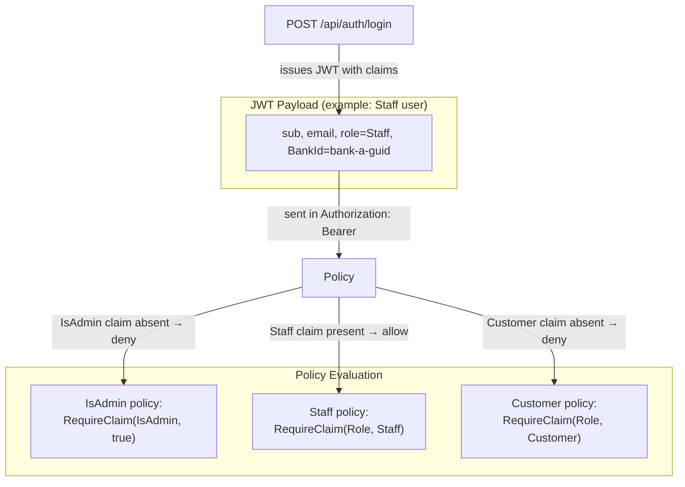

### In this repo

Claims are embedded at login in `JwtTokenService.CreateToken`:

```csharp
// Infrastructure/JwtTokenService.cs
var claims = new List<Claim>
{
    new(JwtRegisteredClaimNames.Sub, user.Id.ToString()),
    new(ClaimTypes.Role, user.Role.ToString()),           // "Staff" / "Customer" / "Admin"
};

if (user.BankId is not null)
    claims.Add(new Claim(AppClaimTypes.BankId, user.BankId.Value.ToString()));

if (user.CustomerId is not null)
    claims.Add(new Claim(AppClaimTypes.CustomerId, user.CustomerId.Value.ToString()));

if (user.Role == Role.Admin)
    claims.Add(new Claim(AppClaimTypes.IsAdmin, "true"));
```

Policies are registered in `Program.cs` using constants from `AuthConstants.cs` (no magic strings):

```csharp
builder.Services.AddAuthorization(options =>
{
    options.AddPolicy(AuthPolicies.IsAdmin,
        policy => policy.RequireClaim(AppClaimTypes.IsAdmin, "true"));
    options.AddPolicy(AuthPolicies.Staff,
        policy => policy.RequireClaim(ClaimTypes.Role, nameof(Role.Staff)));
    options.AddPolicy(AuthPolicies.Customer,
        policy => policy.RequireClaim(ClaimTypes.Role, nameof(Role.Customer)));
});
```

Controllers apply policies at the class level:

```csharp
[Authorize(Policy = AuthPolicies.Staff)]    // rejects non-Staff at the controller level
public sealed class CustomersController : ControllerBase { ... }
```

For finer-grained checks (e.g. a Customer can only fetch _their own_ accounts), the action method
reads claims directly and returns `Forbid()`:

```csharp
// Controllers/CustomersController.cs
[HttpGet("{id:guid}/accounts")]
[Authorize]   // any authenticated user
public async Task<ActionResult<IReadOnlyList<AccountResponse>>> GetAccounts(Guid id)
{
    var isCustomer = HttpContext.User.GetRequiredRole() == nameof(Role.Customer);
    if (isCustomer && HttpContext.User.TryGetCustomerIdClaim() != id)
        return Forbid();   // 403 — customer cannot see another customer's accounts

    return Ok(await _accounts.GetByCustomerId(id));
}
```

### Alternatives

| Alternative                                                | Trade-off                                                                                                                                                              |
|------------------------------------------------------------|------------------------------------------------------------------------------------------------------------------------------------------------------------------------|
| **`[Authorize(Roles = "Staff")]`**                         | Simpler for trivial cases. Cannot express composite rules without custom attributes                                                                                    |
| **Resource-based authorization (`IAuthorizationService`)** | Evaluates policies against a specific resource object. Correct approach for complex per-resource rules; more ceremony                                                  |
| **OAuth 2.0 / OpenID Connect (external IdP)**              | Delegate auth entirely to Keycloak, Auth0, Azure AD, etc. Removes JWT issuance from this service. Required for production multi-tenant SaaS; large operational surface |
| **API keys**                                               | Simple; no expiry handling. No roles, no claims, no per-user identity                                                                                                  |

---

## 14. Middleware Exception Handling

### Concept

Instead of wrapping every controller action in try/catch, a middleware component in the ASP.NET Core
pipeline catches exceptions and maps them to appropriate HTTP responses. This centralises
error-to-HTTP translation in one place.

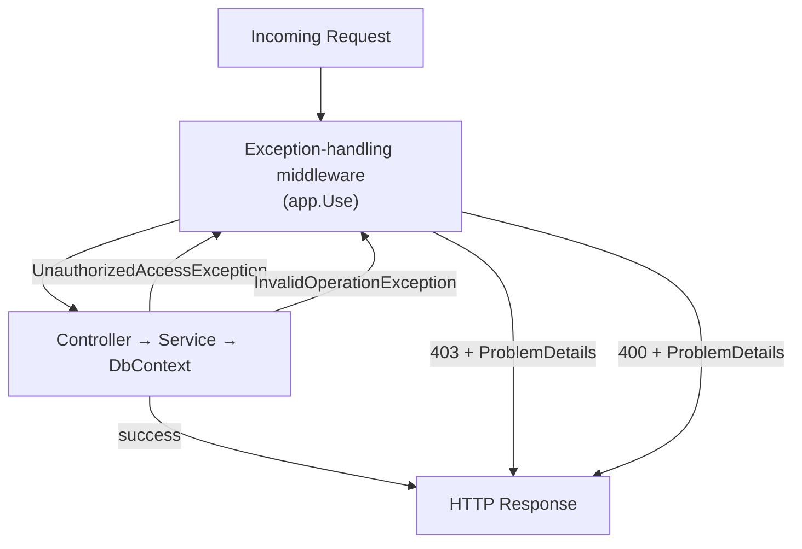

### In this repo

An inline `app.Use` middleware in `Program.cs` catches two exception types:

```csharp
app.Use(async (context, next) =>
{
    try
    {
        await next();
    }
    catch (UnauthorizedAccessException ex)
    {
        // Thrown by BankAccessor.GetRequiredBankId() — missing BankId claim
        context.Response.StatusCode = StatusCodes.Status403Forbidden;
        await context.Response.WriteAsJsonAsync(new ProblemDetails
        {
            Status = 403, Title = "Forbidden", Detail = ex.Message,
        });
    }
    catch (InvalidOperationException ex)
    {
        // Thrown by TransactionFactory.Build() — e.g. "Insufficient funds"
        context.Response.StatusCode = StatusCodes.Status400BadRequest;
        await context.Response.WriteAsJsonAsync(new ProblemDetails
        {
            Status = 400, Title = "Bad Request", Detail = ex.Message,
        });
    }
});
```

Responses use the RFC 7807 `ProblemDetails` format so callers get a structured error body.

### Alternatives

| Alternative                                           | Trade-off                                                                                                                                                 |
|-------------------------------------------------------|-----------------------------------------------------------------------------------------------------------------------------------------------------------|
| **`UseExceptionHandler` / `app.MapProblemDetails()`** | Built-in ASP.NET Core middleware; cleaner. Less control over the mapping from exception type to status code                                               |
| **`[ExceptionFilter]` attribute**                     | Applied per controller or globally via `AddControllers(o => o.Filters.Add(...))`. Can inspect the controller action context. More boilerplate             |
| **`IExceptionHandler` (.NET 8+)**                     | The modern, structured approach — implement an interface, register with `AddExceptionHandler<T>()`. Separates exception-handling logic into its own class |
| **Result pattern (`Result<T, Error>`)**               | Exceptions are not used for control flow at all. Methods return a discriminated union. Explicit; no hidden throws. More code at each call site            |

---

## 15. Design-Time DbContext Factory

### Concept

EF Core's `dotnet ef` CLI tools (for generating migrations and applying schema changes) need to
construct a `DbContext` without a running web host. A class implementing
`IDesignTimeDbContextFactory<T>` tells EF Core exactly how to build the context at design time.

Without this, the CLI must start the full application — which fails if the app requires an
`IBankAccessor` that depends on `IHttpContextAccessor` (there is no HTTP request at design time).

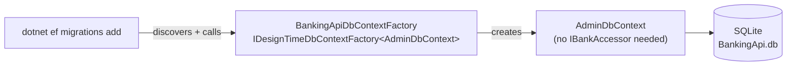

### In this repo

```csharp
// BankingApiDbContextFactory.cs
public sealed class BankingApiDbContextFactory : IDesignTimeDbContextFactory<AdminDbContext>
{
    public AdminDbContext CreateDbContext(string[] args)
    {
        var optionsBuilder = new DbContextOptionsBuilder<AdminDbContext>();
        optionsBuilder.UseSqlite("Data Source=BankingApi.db");
        return new AdminDbContext(optionsBuilder.Options);
    }
}
```

`AdminDbContext` is used (not `TenantDbContext`) because it requires no `IBankAccessor`.
`AdminDbContext` is also the migration owner — all migration files are generated against it:

```
Migrations/
  AdminDbContextModelSnapshot.cs   ← [DbContext(typeof(AdminDbContext))]
  20260219210630_BankingInitial.cs
  20260219211537_BankingRelationships.cs
```

At runtime, `Program.cs` applies migrations using `AdminDbContext` as well:

```csharp
var db = scope.ServiceProvider.GetRequiredService<AdminDbContext>();
await db.Database.MigrateAsync();
```

### Alternatives

| Alternative                                                 | Trade-off                                                                                                         |
|-------------------------------------------------------------|-------------------------------------------------------------------------------------------------------------------|
| **Apply migrations manually (`dotnet ef database update`)** | No runtime migration code. Requires a deployment step; databases can get out of sync                              |
| **Fluent Migrator / DbUp**                                  | SQL-script-based migrations with richer control. Decoupled from EF Core's model; migration files are plain SQL    |
| **`EnsureCreated()` instead of `MigrateAsync()`**           | Creates the schema from scratch with no migration history. Cannot evolve the schema; breaks on existing databases |

---

## 16. Static Constants — Magic String Elimination

### Concept

String literals used in multiple places ("magic strings") are brittle: a typo silently breaks
things, and renaming requires a global search. Centralising these strings in `static` constant
classes makes them refactor-safe and self-documenting.

### In this repo

`AuthConstants.cs` defines two static classes:

```csharp
// Infrastructure/AuthConstants.cs

/// <summary>Custom JWT claim type names used when issuing and reading tokens.</summary>
public static class AppClaimTypes
{
    public const string BankId     = "BankId";
    public const string CustomerId = "CustomerId";
    public const string IsAdmin    = "IsAdmin";
}

/// <summary>Authorization policy names registered in Program.cs.</summary>
public static class AuthPolicies
{
    public const string IsAdmin  = "IsAdmin";
    public const string Staff    = "Staff";
    public const string Customer = "Customer";
}
```

These constants are used consistently at every call site — policy registration, `[Authorize]`
attributes, claim issuance, and claim reading — so changing `"BankId"` to `"bank_id"` everywhere
requires one edit:

```csharp
// Issuing (JwtTokenService.cs)
claims.Add(new Claim(AppClaimTypes.BankId, user.BankId.Value.ToString()));

// Reading (ClaimsExtensions.cs)
var raw = user.FindFirst(AppClaimTypes.BankId)?.Value;

// Policy registration (Program.cs)
options.AddPolicy(AuthPolicies.Staff,
    policy => policy.RequireClaim(ClaimTypes.Role, nameof(Role.Staff)));

// Enforcement (CustomersController.cs)
[Authorize(Policy = AuthPolicies.Staff)]
```

`Currency.cs` uses the same technique for domain values:

```csharp
public static class Currency
{
    public const string Default = "NOK";
}
```

### Alternatives

| Alternative                         | Trade-off                                                                                            |
|-------------------------------------|------------------------------------------------------------------------------------------------------|
| **`nameof()` expressions**          | Refactor-safe for _type_ names; not applicable for arbitrary strings like `"BankId"`                 |
| **`enum` with a string converter**  | Strongly typed; impossible to pass the wrong value. Requires a converter at serialisation boundaries |
| **Source generators for constants** | Auto-generate constants from config or schema. Powerful; complex setup; overkill here                |

---

## 17. CQRS-Lite — Read/Write Path Separation

### Concept

Command Query Responsibility Segregation (CQRS) separates operations that read data (queries) from
operations that change it (commands). Full CQRS uses separate models, separate pipelines, and often
separate databases for reads and writes. This repo uses a lightweight version: the same service
class handles both, but reads and writes take structurally different code paths.

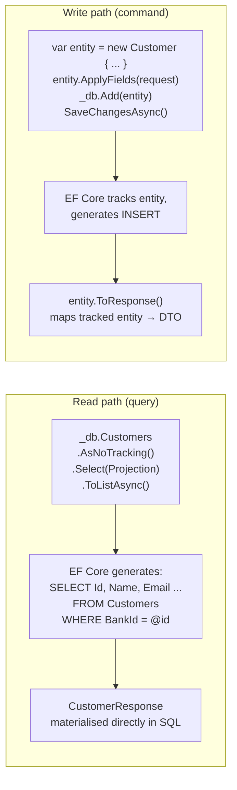

### In this repo

Every service has a clear separation:

- **Reads** use `.AsNoTracking()` + `Projection` expressions — no entity is loaded into the change
  tracker; the DTO is built directly in SQL.
- **Writes** load a tracked entity (or create one), mutate it, call `SaveChangesAsync()`, then map
  via `.ToResponse()`.

```csharp
// Read (CustomersService.cs)
public async Task<IReadOnlyList<CustomerResponse>> GetAll()
{
    return await _db.Customers
        .AsNoTracking()                          // no change tracking
        .OrderBy(x => x.Name)
        .Select(CustomerResponse.Projection)     // SQL-level projection
        .ToListAsync();
}

// Write (CustomersService.cs)
public async Task<CustomerResponse> Create(CustomerRequest request)
{
    var entity = new Customer { Id = Guid.NewGuid(), BankId = _db.BankId, ... };
    entity.ApplyFields(request);                 // tracked entity
    _db.Customers.Add(entity);
    await _db.SaveChangesAsync();
    return entity.ToResponse();                  // map after save
}
```

### Alternatives

| Alternative                                                   | Trade-off                                                                                                                                                         |
|---------------------------------------------------------------|-------------------------------------------------------------------------------------------------------------------------------------------------------------------|
| **Full CQRS with MediatR**                                    | Each command/query is a separate class with its own handler. Excellent separation of concerns; discoverable. Significant ceremony and indirection for simple CRUD |
| **Separate read models (read database / materialized views)** | Read queries against a denormalized read store; writes go to the transactional store. Optimal read performance; complex infrastructure                            |
| **No separation (tracked entities for reads too)**            | Simpler code. EF Core tracks unnecessary state; `.AsNoTracking()` improvements are lost; accidental saves become possible                                         |

---

## 18. OpenAPI Document Transformer

### Concept

ASP.NET Core's native OpenAPI support (introduced in .NET 9) allows transforming the generated
OpenAPI document via `IOpenApiDocumentTransformer`. This lets you modify the document globally —
adding security schemes, servers, tags — without touching individual controllers or using attributes.

### In this repo

`BearerSecuritySchemeTransformer` injects a JWT Bearer security scheme into the OpenAPI document
at the document level:

```csharp
// Program.cs
internal sealed class BearerSecuritySchemeTransformer : IOpenApiDocumentTransformer
{
    public Task TransformAsync(
        OpenApiDocument document,
        OpenApiDocumentTransformerContext context,
        CancellationToken cancellationToken)
    {
        document.Components ??= new OpenApiComponents();
        document.Components.SecuritySchemes ??= new Dictionary<string, IOpenApiSecurityScheme>();

        document.Components.SecuritySchemes["Bearer"] = new OpenApiSecurityScheme
        {
            Type = SecuritySchemeType.Http,
            Scheme = "bearer",
            BearerFormat = "JWT",
        };

        return Task.CompletedTask;
    }
}
```

Registered in `Program.cs`:

```csharp
builder.Services.AddOpenApi(options =>
{
    options.AddDocumentTransformer(new BearerSecuritySchemeTransformer());
});
```

The Scalar UI is served in development for interactive API exploration:

```csharp
if (app.Environment.IsDevelopment())
{
    app.MapOpenApi();
    app.MapScalarApiReference(options => { options.Title = "Banking API"; });
}
```

### Alternatives

| Alternative                                                    | Trade-off                                                                                                             |
|----------------------------------------------------------------|-----------------------------------------------------------------------------------------------------------------------|
| **Swashbuckle (`AddSwaggerGen`)**                              | The traditional choice; large ecosystem of extensions. Heavier; being superseded by native OpenAPI support in .NET 9+ |
| **`[SwaggerOperation]` / `[ProducesResponseType]` attributes** | Documents individual endpoints in place. Fine-grained; verbose; scattered across the codebase                         |
| **NSwag**                                                      | Strong client code generation from the spec. More tooling surface to manage                                           |

---

## Pattern Map

How the patterns connect to each other across the codebase:

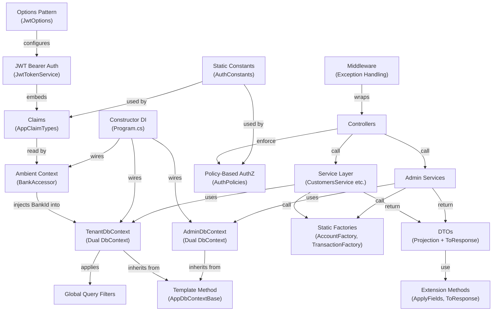
