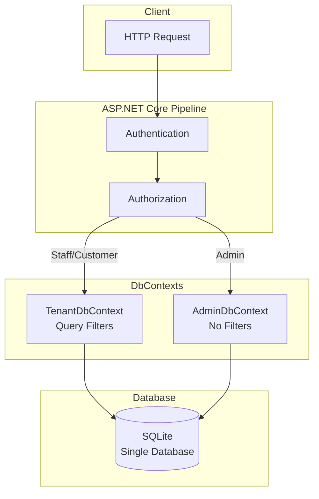
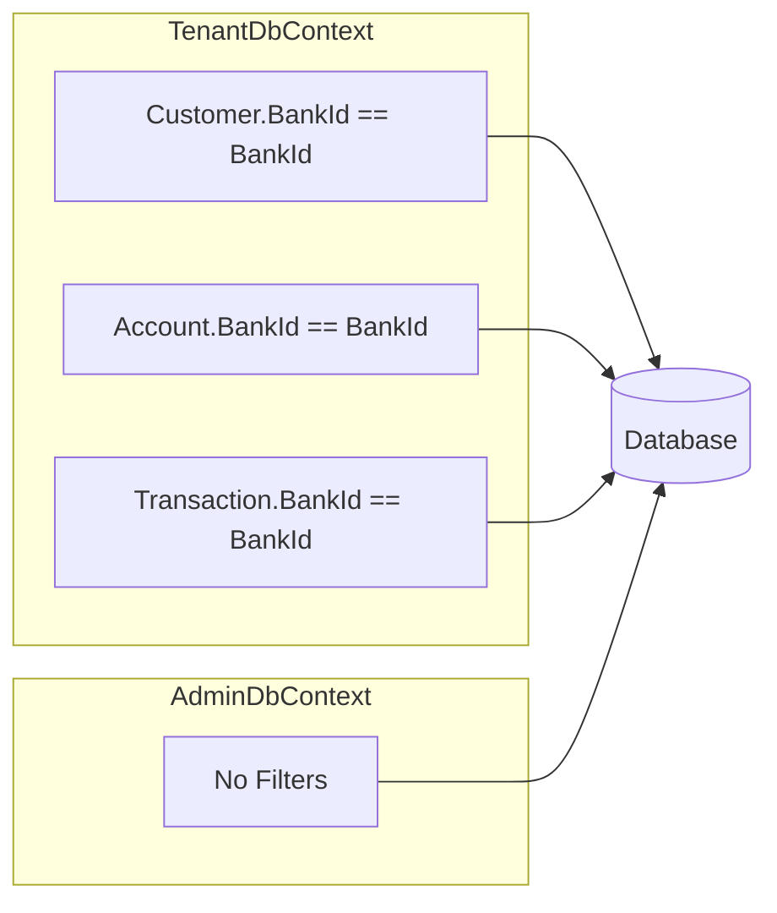
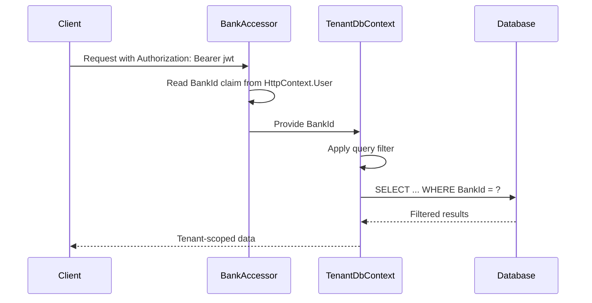
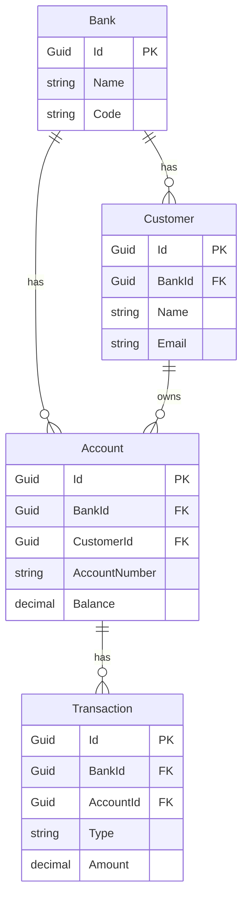
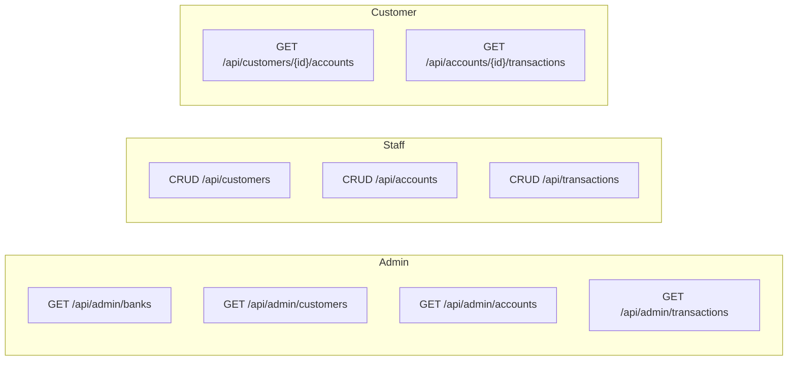
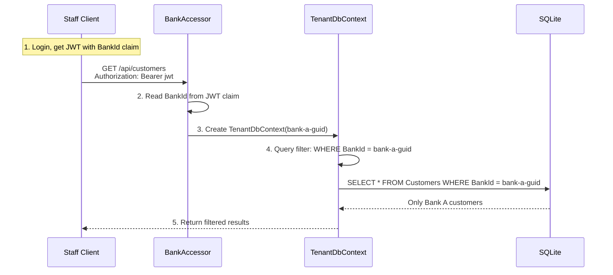

# Banking API: Multi-Tenant EF Core Demo

A minimal demo of multi-tenant data isolation using EF Core with a dual DbContext pattern.

**Live demo:** <https://dotnet-db-multi-tenant-demo.fly.dev/scalar/v1>

## Overview



## Key Concepts

### 1. Dual DbContext Pattern

Two DbContexts map to the same database tables but with different behaviors:

| DbContext         | Purpose                         | Query Filters             |
|-------------------|---------------------------------|---------------------------|
| `TenantDbContext` | Tenant-scoped operations        | Yes — filters by `BankId` |
| `AdminDbContext`  | Cross-tenant admin + migrations | No — sees all data        |



**Implementation:**

[`BankingApi/Data/TenantDbContext.cs`](BankingApi/Data/TenantDbContext.cs):

```csharp
public sealed class TenantDbContext : AppDbContextBase
{
    public Guid BankId { get; }

    public TenantDbContext(DbContextOptions<TenantDbContext> options, IBankAccessor bankAccessor)
        : base(options)
    {
        BankId = bankAccessor.GetRequiredBankId();
    }

    protected override void OnModelCreating(ModelBuilder modelBuilder)
    {
        base.OnModelCreating(modelBuilder);

        // Global query filters ensure tenant isolation
        modelBuilder.Entity<Customer>().HasQueryFilter(x => x.BankId == BankId);
        modelBuilder.Entity<Account>().HasQueryFilter(x => x.BankId == BankId);
        modelBuilder.Entity<Transaction>().HasQueryFilter(x => x.BankId == BankId);
    }
}
```

[`BankingApi/Data/AdminDbContext.cs`](BankingApi/Data/AdminDbContext.cs):

```csharp
public sealed class AdminDbContext : AppDbContextBase
{
    public AdminDbContext(DbContextOptions<AdminDbContext> options) : base(options) { }
    // No query filters — sees all data across all tenants
}
```

### 2. Tenant Resolution

The tenant is resolved from the `BankId` claim in the JWT. Because the JWT is cryptographically signed, no separate header is needed — the claim alone is sufficient and tamper-proof:



[`BankingApi/Infrastructure/BankAccessor.cs`](BankingApi/Infrastructure/BankAccessor.cs):

```csharp
public sealed class BankAccessor : IBankAccessor
{
    private readonly IHttpContextAccessor _httpContextAccessor;

    public BankAccessor(IHttpContextAccessor httpContextAccessor)
    {
        _httpContextAccessor = httpContextAccessor;
    }

    public Guid? TryGetBankId()
    {
        var user = _httpContextAccessor.HttpContext?.User;
        return user?.TryGetBankIdClaim();
    }

    public Guid GetRequiredBankId()
    {
        var bankId = TryGetBankId();
        if (bankId is null)
            throw new UnauthorizedAccessException("Missing BankId claim in token.");
        return bankId.Value;
    }
}
```

### 3. Entity Relationships



### 4. Roles & Access Control

| Role         | Scope         | JWT Claims                              | Endpoints                                                                 |
|--------------|---------------|-----------------------------------------|---------------------------------------------------------------------------|
| **Admin**    | Cross-tenant  | `role=Admin`, `IsAdmin=true`            | `/api/admin/*`                                                            |
| **Staff**    | Single bank   | `role=Staff`, `BankId`                  | `/api/customers`, `/api/accounts`, `/api/transactions`                    |
| **Customer** | Own data only | `role=Customer`, `BankId`, `CustomerId` | `GET /api/customers/{id}/accounts`, `GET /api/accounts/{id}/transactions` |



For the full route list see [`BankingApi/BankingApi.http`](BankingApi/BankingApi.http).

## Request Flow Example



## Run

```bash
dotnet run --project BankingApi/BankingApi.csproj
```

The app:

- Applies migrations on startup (via `AdminDbContext`)
- Seeds demo data on first run
- Starts on `http://localhost:5294`

## Try It

Use [`BankingApi/BankingApi.http`](BankingApi/BankingApi.http) for ready-to-use HTTP examples.

1. **Get seeded login info:**

   ```
   GET /api/auth/seeded-logins
   ```

2. **Login as Staff** (copy `accessToken` from response):

   ```
   POST /api/auth/login
   { "email": "staff.norge@demo.com" }
   ```

3. **Call tenant-scoped endpoints as Staff:**

   ```
   GET /api/customers
   Authorization: Bearer <accessToken>
   ```

4. **Login as Customer** and access own accounts:

   ```
   POST /api/auth/login
   { "email": "customer.ola@demo.com" }

   GET /api/customers/{CustomerId}/accounts
   Authorization: Bearer <accessToken>
   ```

   Attempting to pass another customer's ID returns `403 Forbidden`.

## Seeded Demo Data

| Entity    | Bank A (Norge)        | Bank B (Svensk)        |
|-----------|-----------------------|------------------------|
| Bank Code | NO-001                | SE-001                 |
| Staff     | `staff.norge@demo.com`  | `staff.svensk@demo.com`  |
| Customer  | `customer.ola@demo.com` | `customer.anna@demo.com` |
| Account   | NOK account           | SEK account            |

Admin: `admin@demo.com` (cross-tenant access)

## Project Structure

```
BankingApi/
├── Controllers/
│   ├── Admin/                       # Cross-tenant admin endpoints (IsAdmin policy)
│   │   ├── AdminBanksController.cs
│   │   ├── AdminCustomersController.cs
│   │   ├── AdminAccountsController.cs
│   │   └── AdminTransactionsController.cs
│   ├── CustomersController.cs       # Staff: CRUD + GET {id}/accounts (Customer: own only)
│   ├── AccountsController.cs        # Staff: CRUD + GET {id}/transactions (Customer: own only)
│   ├── TransactionsController.cs    # Staff: CRUD
│   └── AuthController.cs            # Login (anonymous)
├── Data/
│   ├── AppDbContextBase.cs          # Shared model configuration
│   ├── TenantDbContext.cs           # Query-filtered context
│   └── AdminDbContext.cs            # Unfiltered context
├── Infrastructure/
│   ├── AuthConstants.cs             # AppClaimTypes and AuthPolicies constants
│   ├── BankAccessor.cs              # JWT claim-based tenant resolution
│   ├── ClaimsExtensions.cs          # HttpContext.User claim helpers
│   ├── JwtTokenService.cs           # JWT generation with role/BankId/CustomerId claims
│   └── SeedData.cs                  # Demo data seeding
├── Models/                          # Bank, Customer, Account, Transaction, User
├── Dtos/                            # Request/response DTOs with Projection() + ToResponse()
├── Services/
│   ├── Admin/                       # Admin services (unfiltered, cross-tenant)
│   ├── AuthService.cs               # Login lookup and seeded-logins query
│   ├── AccountFactory.cs            # Shared account construction logic
│   ├── AccountsService.cs
│   ├── CustomersService.cs
│   ├── TransactionFactory.cs        # Shared transaction construction logic
│   └── TransactionsService.cs
└── Program.cs                       # DI, auth policies, middleware pipeline
```

## Key Files

| File                                                                                | Purpose                                             |
|-------------------------------------------------------------------------------------|-----------------------------------------------------|
| [`Program.cs`](BankingApi/Program.cs)                                               | DI setup, auth policies, middleware pipeline        |
| [`Data/TenantDbContext.cs`](BankingApi/Data/TenantDbContext.cs)                     | Global query filters for tenant isolation           |
| [`Data/AdminDbContext.cs`](BankingApi/Data/AdminDbContext.cs)                       | Unfiltered context for admin/migrations             |
| [`Infrastructure/BankAccessor.cs`](BankingApi/Infrastructure/BankAccessor.cs)       | Resolve tenant from JWT claim                       |
| [`Infrastructure/AuthConstants.cs`](BankingApi/Infrastructure/AuthConstants.cs)     | `AppClaimTypes` and `AuthPolicies` string constants |
| [`Infrastructure/JwtTokenService.cs`](BankingApi/Infrastructure/JwtTokenService.cs) | Issue JWTs with role/BankId/CustomerId claims       |
| [`Infrastructure/SeedData.cs`](BankingApi/Infrastructure/SeedData.cs)               | Create demo banks, customers, accounts, users       |
