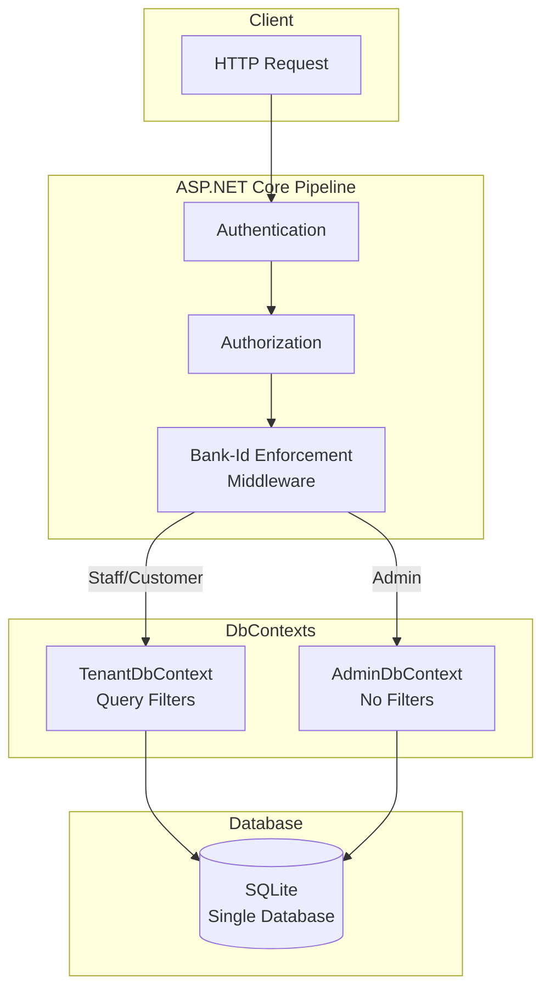
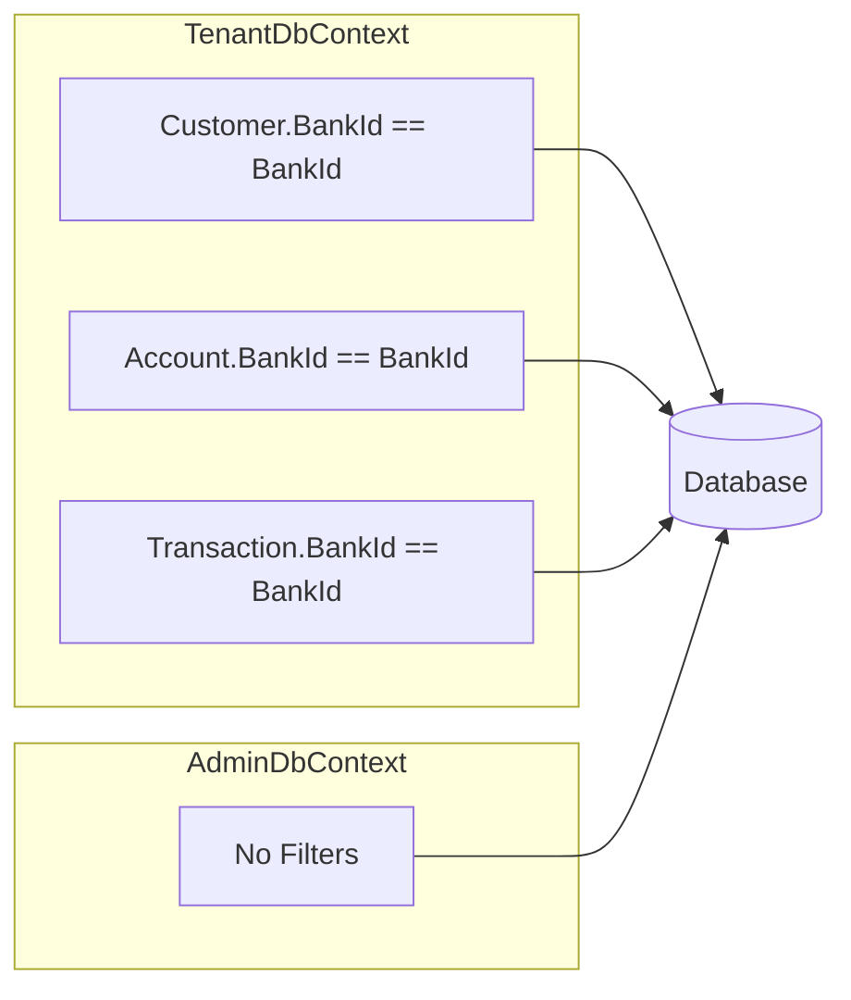
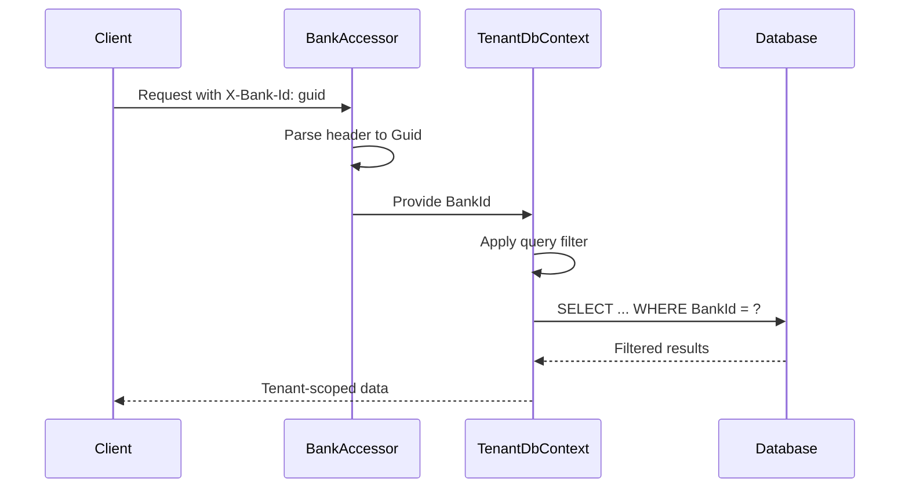
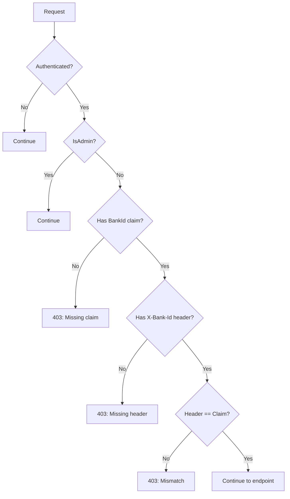
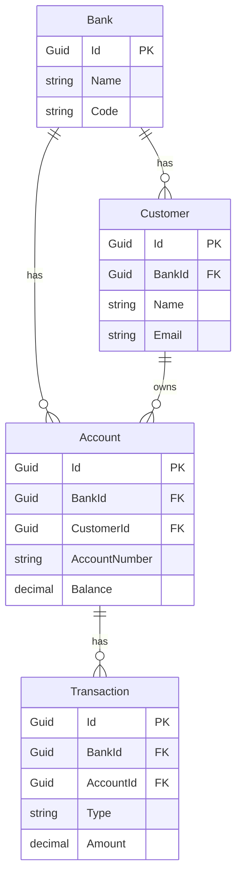
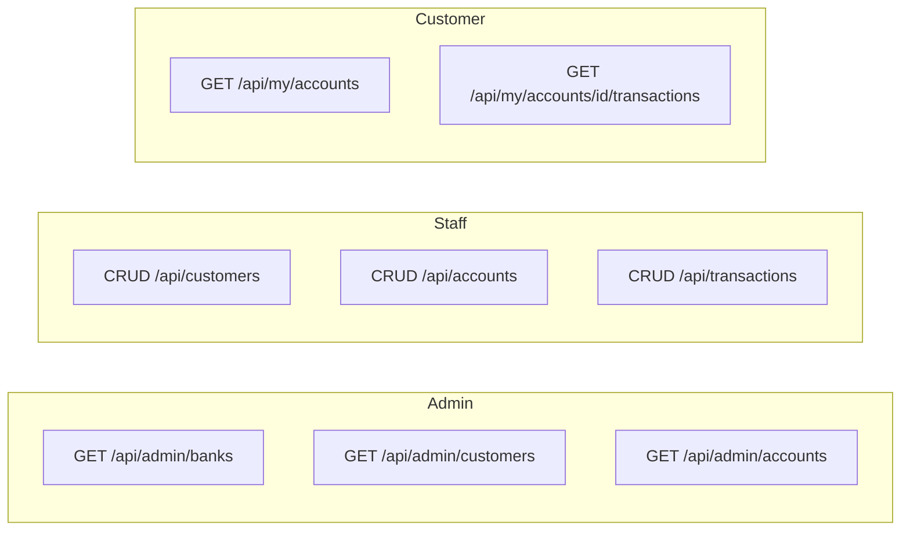
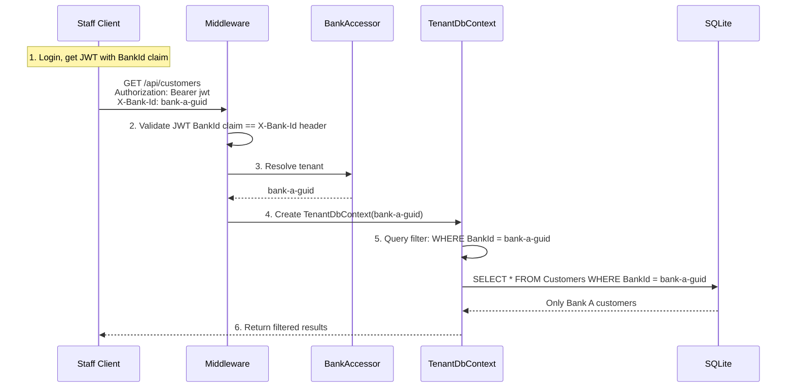

# Banking API: Multi-Tenant EF Core Demo

A minimal demo of multi-tenant data isolation using EF Core with a dual DbContext pattern.

## Overview



## Key Concepts

### 1. Dual DbContext Pattern

Two DbContexts map to the same database tables but with different behaviors:

| DbContext | Purpose | Query Filters |
|-----------|---------|---------------|
| `TenantDbContext` | Tenant-scoped operations | Yes - filters by `BankId` |
| `AdminDbContext` | Cross-tenant admin + migrations | No - sees all data |



**Implementation:**

[`BankingApi/Data/TenantDbContext.cs`](BankingApi/Data/TenantDbContext.cs):
```csharp
public sealed class TenantDbContext : AppDbContextBase
{
    public Guid BankId { get; }

    public TenantDbContext(DbContextOptions<TenantDbContext> options, IBankAccessor bankAccessor)
        : base(options)
    {
        BankId = bankAccessor.GetRequiredBankId();
    }

    protected override void OnModelCreating(ModelBuilder modelBuilder)
    {
        base.OnModelCreating(modelBuilder);

        // Global query filters ensure tenant isolation
        modelBuilder.Entity<Customer>().HasQueryFilter(x => x.BankId == BankId);
        modelBuilder.Entity<Account>().HasQueryFilter(x => x.BankId == BankId);
        modelBuilder.Entity<Transaction>().HasQueryFilter(x => x.BankId == BankId);
    }
}
```

[`BankingApi/Data/AdminDbContext.cs`](BankingApi/Data/AdminDbContext.cs):
```csharp
public sealed class AdminDbContext : AppDbContextBase
{
    public AdminDbContext(DbContextOptions<AdminDbContext> options) : base(options) { }
    // No query filters - sees all data across all tenants
}
```

### 2. Tenant Resolution

Tenant is resolved from the `X-Bank-Id` HTTP header:



[`BankingApi/Infrastructure/BankAccessor.cs`](BankingApi/Infrastructure/BankAccessor.cs):
```csharp
public sealed class BankAccessor : IBankAccessor
{
    public const string BankIdHeader = "X-Bank-Id";

    public Guid GetRequiredBankId()
    {
        var httpContext = _httpContextAccessor.HttpContext;
        if (!httpContext.Request.Headers.TryGetValue(BankIdHeader, out var raw))
        {
            throw new UnauthorizedAccessException($"Missing bank id.");
        }
        return Guid.TryParse(raw.ToString(), out var bankId) 
            ? bankId 
            : throw new UnauthorizedAccessException("Invalid bank id format.");
    }
}
```

### 3. Security: Header-Claim Validation

To prevent cross-tenant spoofing, middleware validates that the `X-Bank-Id` header matches the `BankId` claim in the JWT:



[`BankingApi/Program.cs`](BankingApi/Program.cs) (middleware):
```csharp
app.Use(async (context, next) =>
{
    if (context.User?.Identity?.IsAuthenticated != true) { await next(); return; }
    if (context.User?.HasClaim("IsAdmin", "true") == true) { await next(); return; }

    var role = context.User?.FindFirst(ClaimTypes.Role)?.Value;
    if (role is "Staff" or "Customer")
    {
        var bankIdClaim = context.User?.FindFirst("BankId")?.Value;
        if (!Guid.TryParse(bankIdClaim, out var bankIdFromClaim))
        {
            return Forbidden("Missing BankId claim");
        }

        if (!context.Request.Headers.TryGetValue(BankAccessor.BankIdHeader, out var rawHeader))
        {
            return Forbidden("Missing X-Bank-Id header");
        }

        if (bankIdFromHeader != bankIdFromClaim)
        {
            return Forbidden("X-Bank-Id does not match token BankId");
        }
    }
    await next();
});
```

### 4. Entity Relationships



### 5. Roles & Access Control

| Role | Scope | JWT Claims | Endpoints |
|------|-------|------------|-----------|
| **Admin** | Cross-tenant | `IsAdmin=true` | `/api/admin/*` |
| **Staff** | Single bank | `role=Staff`, `BankId` | `/api/customers`, `/api/accounts`, `/api/transactions` |
| **Customer** | Own data only | `role=Customer`, `BankId`, `CustomerId` | `/api/my/accounts` (read-only) |



## Request Flow Example



## Run

```bash
dotnet run --project BankingApi/BankingApi.csproj
```

The app:
- Applies migrations on startup (via `AdminDbContext`)
- Seeds demo data on first run
- Starts on `http://localhost:5294`

## Try It

Use [`BankingApi/BankingApi.http`](BankingApi/BankingApi.http) for ready-to-use HTTP examples.

1. **Get seeded login info:**
   ```
   GET /api/auth/seeded-logins
   ```

2. **Login** (copy `accessToken` and `bankId` from response):
   ```
   POST /api/auth/login
   { "email": "staff.norge@demo.com", "password": "password" }
   ```

3. **Call tenant-scoped endpoints:**
   ```
   GET /api/customers
   Authorization: Bearer <accessToken>
   X-Bank-Id: <bankId>
   ```

## Seeded Demo Data

| Entity | Bank A (Norge) | Bank B (Svensk) |
|--------|----------------|-----------------|
| Bank Code | NO-001 | SE-001 |
| Staff | staff.norge@demo.com | staff.svensk@demo.com |
| Customer | customer.ola@demo.com | customer.anna@demo.com |
| Account | NOK account | SEK account |

Password for all seeded users: `password`

Admin: `admin@demo.com` (cross-tenant access)

## Project Structure

```
BankingApi/
├── Controllers/
│   ├── Admin/              # Cross-tenant admin endpoints
│   ├── CustomersController.cs   # Staff: CRUD customers
│   ├── AccountsController.cs    # Staff: CRUD accounts
│   ├── TransactionsController.cs # Staff: CRUD transactions
│   ├── MyAccountsController.cs  # Customer: read own accounts
│   └── AuthController.cs        # Login
├── Data/
│   ├── AppDbContextBase.cs      # Shared model configuration
│   ├── TenantDbContext.cs       # Query-filtered context
│   └── AdminDbContext.cs        # Unfiltered context
├── Infrastructure/
│   ├── BankAccessor.cs          # X-Bank-Id header resolution
│   ├── JwtTokenService.cs       # JWT generation with claims
│   └── SeedData.cs              # Demo data seeding
├── Models/                      # Bank, Customer, Account, Transaction
├── Dtos/                        # Request/response DTOs
├── Services/                    # Business logic (tenant-scoped)
│   └── Admin/                   # Admin services (unfiltered)
└── Program.cs                   # DI, auth, middleware pipeline
```

## Key Files

| File | Purpose |
|------|---------|
| [`Program.cs`](BankingApi/Program.cs) | DI setup, auth policies, bank-id enforcement middleware |
| [`Data/TenantDbContext.cs`](BankingApi/Data/TenantDbContext.cs) | Global query filters for tenant isolation |
| [`Data/AdminDbContext.cs`](BankingApi/Data/AdminDbContext.cs) | Unfiltered context for admin/migrations |
| [`Infrastructure/BankAccessor.cs`](BankingApi/Infrastructure/BankAccessor.cs) | Resolve tenant from HTTP header |
| [`Infrastructure/JwtTokenService.cs`](BankingApi/Infrastructure/JwtTokenService.cs) | Issue JWTs with role/BankId/CustomerId claims |
| [`Infrastructure/SeedData.cs`](BankingApi/Infrastructure/SeedData.cs) | Create demo banks, customers, accounts, users |
